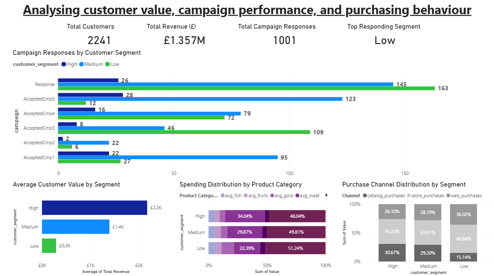

# customer-marketing
Customer & Marketing Analytics project analysing Kaggle’s Customer Personality dataset. Segments customers by value, evaluates campaign responses, spending patterns, and channel usage to generate actionable insights and support marketing decisions.

---

## Customer & Marketing Analytics Project

### Project Overview
This project analyses customer behaviour and marketing campaign performance to identify the most valuable customers and which campaigns drive the best response. The goal is to provide actionable insights to support business decision-making.

---

### Data
- **Dataset:** `Customers.csv` from Kaggle Marketing Campaign / Customer Personality Analysis  
- **Contents:** Customer demographics, spending by category, campaign responses, and purchase channels  
- **Data Cleaning:**  
  - Income column: invalid or empty entries converted to NULL  
  - Rows with NULL income retained; numeric conversions applied in SQL  
  - Spending columns ensured no NULLs (COALESCE to 0)  

---

### SQL Analysis
- **Tables / Views created:**  
  - `total_spent_per_customer` → total spend across all product categories  
  - `customer_segments` → High / Medium / Low value segmentation  
  - `campaign_responses_by_segment` → responses by segment per campaign  
  - `avg_spending_by_category` → average spending per category per segment  
  - `channel_usage_by_segment` → web/store/catalog purchase patterns  

- **Insights from SQL:**  
  - High-value customers spend most on AcceptedCmp5  
  - Medium and Low-value customers respond more to the latest campaign (`Response`)  
  - Web channel dominates for High-value customers; Store for Low; Medium uses all channels fairly evenly  

---

### Power BI Dashboard

**Overview / KPIs:**  
- Total Customers  
- Total Revenue  
- Average Customer Value  
- Top Segment per Campaign (KPI card)  

**Visuals:**  
1. **Customer Segments:** High / Medium / Low value  
2. **Campaign Performance:** Responses by campaign, segmented by High/Medium/Low  
3. **Spending by Category:** Column chart showing which products drive revenue per segment  
4. **Channel Usage:** 100% stacked column chart comparing Web, Store, and Catalog usage per segment  

**Key Insights:**  
- Overall, the latest campaign (`Response`) drives the highest total responses  
- High-value customers responded most to AcceptedCmp5  
- Medium and Low segments respond more to the latest campaign, highlighting the importance of segment-targeted campaigns  
- Average customer value: High £2,200, Medium £1,400, Low £300  
- Product category distribution: Wine is the largest category for all segments, followed by Meat; Low segment shows proportionally higher spending on Gold, Fruit, Fish, Sweets but very small volumes overall  
- Channel usage:  
  - High → Web 26%, Store 43%, Catalog 30%  
  - Medium → Web 18%, Store 42%, Catalog 30%  
  - Low → Web 36%, Store 48%, Catalog 15%  
- **Implication:** Store campaigns are effective for Low; Web campaigns work best for High; Catalog underperforms for Low  
- Insights suggest segment-specific campaigns, product promotions, and channel optimisations will improve engagement and ROI  

---

### Project Structure
- data/ # Original Kaggle dataset CSV
- sql/analysis.sql # SQL queries and views used
- sql/combined.sql # Optional: combined query for reference
- dashboard/Marketing_campaign_dashboard.png # Screenshot of the Power BI dashboard
- README.md # This documentation file
